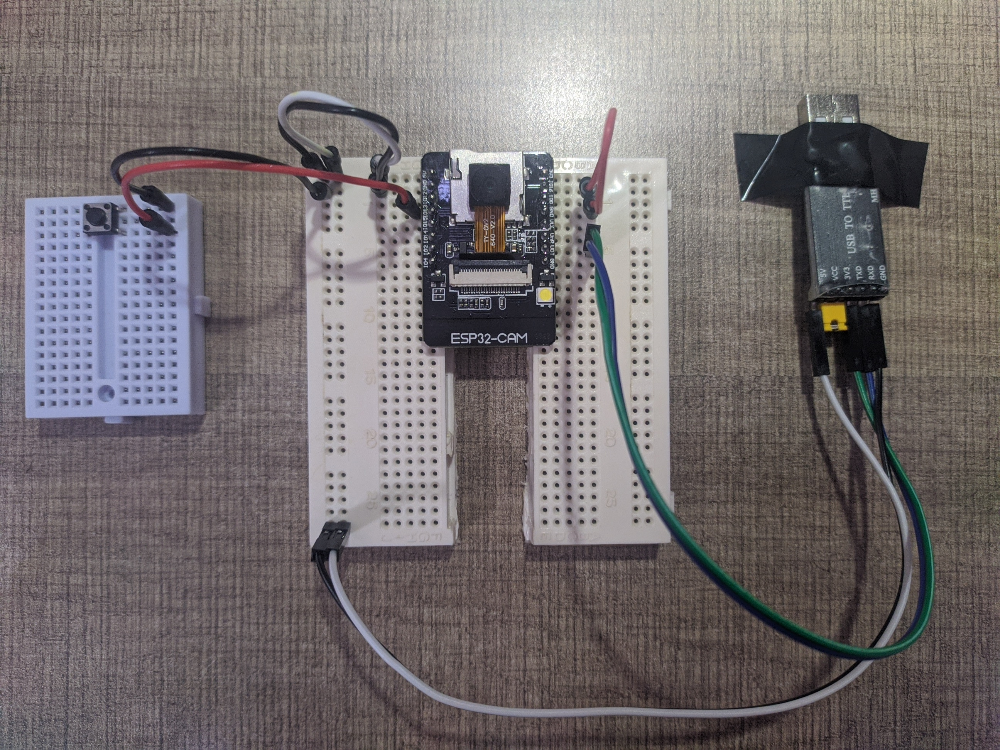

# Not SpyCam Project

## Brief Introduction

An Arduino project with ESP32-Cam as described in the title.

The illustration below shows the setup for flashing ESP32-Cam. The button is connected to `GND` and `GPIO13`. As of `GPIO0` will be connected to `GND` to get to flashing mode, this connection must be disconnected in order to run the ESP32 normally.



As for the TTL, the port can be described as such:

| Index | TTL | ESP32 |
| ----- | --- | ----- |
| 1     | 5V  | 5V    |
| 2     | GND | GND   |
| 3     | TX  | U0R   |
| 4     | RX  | U0T   |

This work is originated from ESP32-Cam example from ESP32 board version 2.0.5.

*This project started in December 2021 and replaced in December 2022.*

## Specification

| Specification    | Detail                      | Version |
| ---------------- | --------------------------- | ------- |
| Device           | ESP32-Cam FOCE (AI-Thinker) |         |
| Camera           | OV2640                      |         |
| ESP32 Board      | (*For ArduinoIDE*)          | 2.0.5   |
| Platform IO Core |                             | 5.2.4   |
| Platform IO Home |                             | 3.4.0   |

## Setup

1. Install [VSCode](https://code.visualstudio.com/download)

2. Go to *marketplace* and install *PlatformIO*

3. Clone this [repository](https://github.com/xiaoming857/not_spycam)
   
   ```shell
   git clone https://github.com/xiaoming857/not_spycam.git
   ```

4. Open the project folder *not_spycam* from VSCode

5. Connect the TTL to the computer

6. Click on the upload button

## To Do

- Add LCD for debugging.

- Set up access point.

- Add fan for cooling.

## Main Sources

- [GitHub - espressif/esp32-camera](https://github.com/espressif/esp32-camera)

- [ESP32-CAM with PlatformIO: Video streaming and face recognition](https://www.survivingwithandroid.com/esp32-cam-platformio-video-streaming-face-recognition/)

## Other Helpful Sources

- [Accessing ESP32-CAM Video Streaming from anywhere in the ...](https://www.elementzonline.com/blog/Accessing-ESP32-CAM-Video-Streaming-from-anywhere-in-the-world)

- [ESP32 Access Point (AP) for Web Server | Random Nerd Tutorials](https://randomnerdtutorials.com/esp32-access-point-ap-web-server/)
